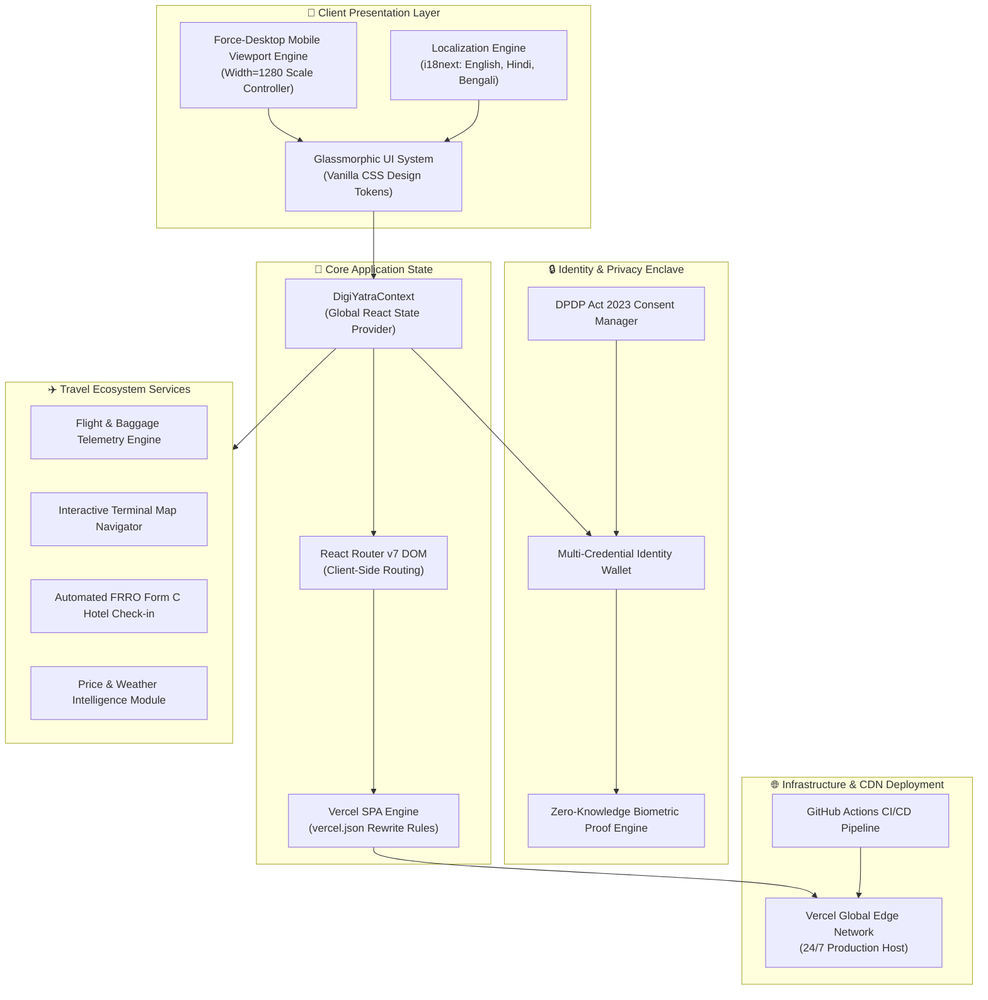
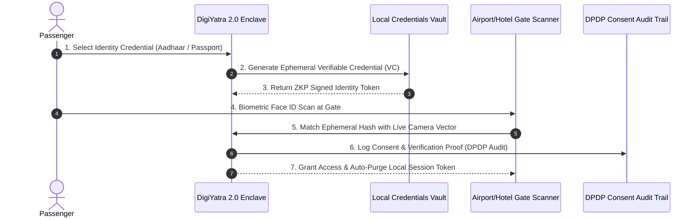

# 🛫 DigiYatra 2.0 – Verified Identity & Universal Seamless Travel

<div align="center">

[](https://digiyatra-2-0.vercel.app)
[](https://github.com/Aniket-Das-2006/Digiyatra-2.0)
[](https://opensource.org/licenses/MIT)
[](https://react.dev/)
[](https://vitejs.dev/)
[](https://meity.gov.in)

**A Next-Generation Decentralized Biometric Identity & Universal Travel Orchestration Platform**

[🌐 **Explore Live Production App**](https://digiyatra-2-0.vercel.app) • [📖 **Project Documentation**](#-system-architecture) • [🚀 **Quickstart Guide**](#-getting-started)

</div>

---

## 📌 Executive Summary

**DigiYatra 2.0** is an enterprise-grade redesign and architectural evolution of India's digital travel identity ecosystem. Designed to integrate seamless biometric verification across domestic and international transport networks, hospitality sectors, and security checkpoints, DigiYatra 2.0 merges **Self-Sovereign Identity (SSI)** principles with modern, high-performance web engineering.

Built with **React 18/19**, **Vite**, custom **Glassmorphic Design Tokens**, and **Zero-Trust Client Enclave Simulation**, the platform provides paperless, contact-free transit for airport check-in, automated FRRO Form C hotel check-ins, real-time baggage telemetry, and multi-credential identity management.

---

## 📐 System Architecture

The DigiYatra 2.0 system is structured into five decoupled layers to ensure strict data privacy, low-latency client rendering, and seamless cross-platform interoperability.



---

## 🔄 Zero-Trust Biometric Data Flow

DigiYatra 2.0 implements **Privacy-by-Design**. Biometric templates and identity credentials (Aadhaar, Passport, DigiLocker, IATA One ID) remain stored exclusively inside local client storage enclaves. No central database stores plaintext biometric data.



---

## ✨ Key Feature Breakdown

### 1. 🛂 Biometric Multi-Credential Wallet
* **Unified Identity Hub**: Store and manage Aadhaar, Indian Passport, DigiLocker, and IATA One ID credentials in a single cryptographically secure interface.
* **Biometric Scan Simulator**: Real-time canvas-based facial recognition scanner (`FaceIdAnimation.jsx`) with dynamic biometric mesh overlays.
* **Instant Revocation**: Passengers retain 100% control over shared data with one-click credential purging.

### 2. ✈️ Flight & Baggage Telemetry
* **Live Flight Radar**: Track flight status, gate changes, boarding times, and delay predictions.
* **Smart Terminal Maps**: Interactive airport map layout (`SmartAirportMap.jsx`) with gate-to-gate turn-by-turn navigation.
* **RFID Baggage Tracking**: Real-time luggage status notification from check-in to belt claim.

### 3. 🏨 Hotel & Hospitality Ecosystem
* **Automated Form C Wizard**: Seamless registration wizard for international and domestic travelers compliant with FRRO & Bureau of Immigration requirements.
* **Biometric Room Key**: Contactless digital room access token generation.
* **Simplified Bill Settlement**: Integrated hotel folio review and zero-touch checkout.

### 4. 🔒 Privacy & Trust Center (DPDP Act 2023)
* **Granular Consent Manager**: Explicit opt-in/opt-out permissions for airline, hotel, and security data sharing.
* **Immutable Audit Trail**: Transparent log of all identity verifications and data access requests.

### 5. 🌍 Dynamic Localization & Mobile Desktop Viewport
* **Multilingual i18n**: Seamless switching between **English**, **Hindi**, and **Bengali**.
* **Force-Desktop Mobile Controller**: Custom JavaScript viewport controller in `index.html` ensuring mobile devices render high-density Desktop UI layouts (`width=1280`) by default.

---

## 🛠 Tech Stack

| Domain | Technology / Tool | Purpose |
| :--- | :--- | :--- |
| **Frontend Core** | React 18/19, Vite 8 | Declarative component engine & lightning-fast ESM bundling |
| **Routing** | React Router DOM v7 | Client-side Single Page Application (SPA) routing |
| **Styling** | Custom Vanilla CSS3 | Glassmorphic design tokens, HSL color variables, CSS Grid |
| **Icons** | Lucide React | Modern, lightweight SVG iconography |
| **Localization** | `i18next`, `react-i18next` | Internationalization dictionary framework |
| **Hosting & CDN** | Vercel Edge Network | 24/7 Global static hosting & SPA rewrite engine |
| **CI/CD** | GitHub Actions | Automated build and deployment pipelines |

---

## 📂 Repository Architecture

```text
Digiyatra-2.0/
├── .github/
│   └── workflows/
│       └── deploy.yml            # GitHub Actions CI/CD Pipeline
├── public/
│   ├── FC.mp4                    # Hero Background Video (Compressed)
│   ├── HC.mp4                    # Hotel Ecosystem Video (Compressed)
│   ├── HV.mp4                    # Flight Telemetry Video (Compressed)
│   └── favicon.svg               # Application Brand Icon
├── src/
│   ├── components/               # Modular UI Components
│   │   ├── BaggageTracker.jsx    # Real-time luggage telemetry
│   │   ├── BookingModal.jsx      # Universal booking flow modal
│   │   ├── ConsentManager.jsx    # DPDP Act 2023 privacy controls
│   │   ├── FaceIdAnimation.jsx   # Biometric scanning visualizer
│   │   ├── FlightTracker.jsx     # Live flight status component
│   │   ├── FormCWizard.jsx       # Hotel FRRO Form C auto-filler
│   │   ├── Header.jsx            # Glassmorphic header & navigation
│   │   ├── IdentityWallet.jsx    # Verifiable credentials manager
│   │   ├── SmartAirportMap.jsx   # Airport terminal interactive map
│   │   └── TrustCenter.jsx       # Security compliance dashboard
│   ├── context/
│   │   └── DigiYatraContext.jsx  # Global application state manager
│   ├── data/                     # Mock data engines & flight DB
│   ├── hooks/
│   │   └── useAnimations.js      # Scroll reveal & viewport hooks
│   ├── locales/                  # Translation dictionaries (en, hi, bn)
│   ├── pages/                    # Main views (DigiYatra, Hotels, Info)
│   │   ├── DigiYatraPage.jsx
│   │   ├── HotelsStayPage.jsx
│   │   └── InfoPage.jsx
│   ├── App.jsx                   # React Router entry point
│   ├── i18n.js                   # i18n configuration module
│   └── main.jsx                  # React DOM mount point
├── .gitignore                    # Git file exclusion rules
├── .vercelignore                 # Vercel deployment exclusion rules
├── index.html                    # Entry HTML & Desktop Viewport Engine
├── package.json                  # Dependencies & build scripts
├── README.md                     # Technical Documentation
├── vercel.json                   # Vercel SPA Rewrite Rules
└── vite.config.js                # Vite build & dev server config
```

---

## 🚀 Getting Started

### Prerequisites
* **Node.js**: v18.0.0 or higher
* **npm**: v9.0.0 or higher

### Local Development Installation

1. **Clone the Repository:**
   ```bash
   git clone https://github.com/Aniket-Das-2006/Digiyatra-2.0.git
   cd Digiyatra-2.0
   ```

2. **Install Dependencies:**
   ```bash
   npm install
   ```

3. **Start Development Server:**
   ```bash
   npm run dev
   ```
   *Access local server at `http://localhost:3000`*

4. **Build Production Bundle:**
   ```bash
   npm run build
   ```

---

## 🌐 Live Deployment & Infrastructure

The production application is deployed on Vercel's Global Edge Network, providing instant loading, automated SSL, and 24/7 availability.

* 🔗 **Live Production Application**: [https://digiyatra-2-0.vercel.app](https://digiyatra-2-0.vercel.app)
* 🔗 **GitHub Repository**: [https://github.com/Aniket-Das-2006/Digiyatra-2.0](https://github.com/Aniket-Das-2006/Digiyatra-2.0)

---

## ⚖️ License

This project is licensed under the **MIT License** – see the [LICENSE](LICENSE) file for details.

```text
MIT License
Copyright (c) 2026 Aniket Das
```

---

<div align="center">

**Crafted with ❤️ by [Aniket Das](https://github.com/Aniket-Das-2006)**  
*Building India's Digital Travel Infrastructure for Tomorrow.*

</div>
