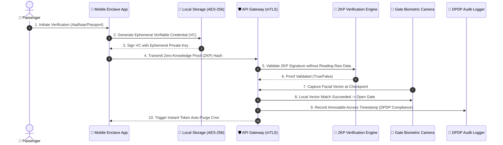
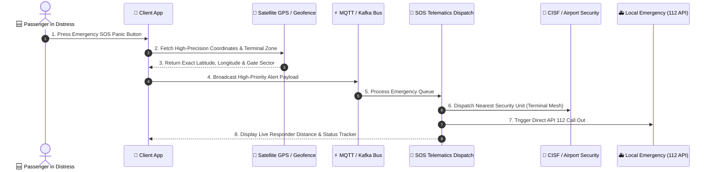

# 🛫 DigiYatra 2.0 – Verified Identity, Universal Travel & Cloud Microservices Architecture

<div align="center">

[](https://digiyatra-2-0.vercel.app)
[](https://github.com/Aniket-Das-2006/Digiyatra-2.0)
[](https://opensource.org/licenses/MIT)
[](https://react.dev/)
[](https://vitejs.dev/)
[](#-security-encryption--cloud-store)
[](#-data-privacy--compliance-framework)
[](#-support--buy-me-a-coffee)

**An Enterprise-Grade, Self-Sovereign Biometric Identity, Real-Time Telemetry & Distributed Travel Orchestration Platform**

[🌐 **Explore Live Production App**](https://digiyatra-2-0.vercel.app) • [📐 **Master System Architecture**](#-master-system-architecture) • [🚀 **Developer Quickstart**](#-getting-started) • [☕ **Support Project**](#-support--buy-me-a-coffee)

</div>

---

## 📌 Executive Summary

**DigiYatra 2.0** represents a vision for India's digital transit infrastructure. Designed as a high-throughput, zero-trust platform, DigiYatra 2.0 unifies biometric identity verification, real-time aviation telemetry, IoT baggage tracking, automated FRRO hospitality compliance, emergency SOS telematics, and multi-credential self-sovereign wallets into one cohesive ecosystem.

Built with **React 18/19**, **Vite**, **Glassmorphic HSL Design Tokens**, **Vercel Global Edge CDN**, and designed for a multi-region **Node.js/Go Microservices Backend**, DigiYatra 2.0 eliminates friction at airport boarding gates, hotel check-ins, and security checkpoints while enforcing strict adherence to India's **DPDP Act 2023** and **IATA One ID** standards.

---

## 📐 Master System Architecture

The blueprint below details the complete full-stack enterprise architecture of DigiYatra 2.0, spanning client presentation, security enclaves, API gateways, event streaming buses, microservices, and external government/aviation integrations.

```mermaid
graph TB
    subgraph Client_Layer["📱 Client Presentation & Viewport Layer"]
        ReactApp["React 19 + Vite SPA Engine"]
        GlassUI["Glassmorphic UI Design System"]
        ViewportController["Force-Desktop Mobile Viewport Engine (width=1280)"]
        i18nEngine["Multilingual Engine (English, Hindi, Bengali)"]
    end

    subgraph API_Gateway_Security["🛡️ Edge API Gateway & Security Firewall"]
        APIGateway["Kong / Cloudflare API Gateway"]
        WAF["Web Application Firewall (WAF) & Rate Limiter"]
        OAuth2["OAuth2 / OIDC + Mutual TLS (mTLS) Auth"]
    end

    subgraph Messaging_Event_Bus["⚡ Real-Time Messaging & Event Bus"]
        Kafka["Apache Kafka Event Streaming"]
        MQTT["MQTT Broker (IoT Baggage & Telemetry)"]
        WebSocket["WebSocket Server (Live Flight & Gate Pushes)"]
    end

    subgraph Microservices_Core["⚙️ Enterprise Microservices Core"]
        IdentityService["Identity & Biometric Service<br/>(W3C DID Issuer & ZKP Proof Validator)"]
        FlightService["Flight Telemetry Service<br/>(Live Amadeus / FlightRadar24 Integration)"]
        BaggageService["IoT Baggage & GPS Tracking Service<br/>(RFID Mesh & BLE Beacon Resolver)"]
        HotelService["Hospitality & FRRO Service<br/>(Automated Form C Immigration Engine)"]
        BookingService["Booking & Payment Gateway Service<br/>(IRCTC & Tokenized UPI Connector)"]
        SOSService["Emergency SOS Telematics Service<br/>(CISF & Police 112 Rapid Dispatch)"]
    end

    subgraph Cloud_Security_Store["🔒 Cloud Security & Encrypted Data Store"]
        HSM Vault["Hardware Security Module (HSM) Key Vault"]
        ZeroTrustDB["PostgreSQL + CockroachDB<br/>(AES-256-GCM Encrypted at Rest)"]
        RedisCache["Redis Cluster (Session & Real-Time Cache)"]
        StorageEnclave["Zero-Knowledge Data Vault<br/>(Biometric Template Enclave)"]
    end

    subgraph External_Integrations["🌐 External Government & Industry Connectors"]
        Aadhaar["UIDAI Aadhaar API"]
        Passport["DigiLocker / Passport Seva API"]
        IATA["IATA One ID Trust Registry"]
        FRRO["Bureau of Immigration (FRRO Portal)"]
        Emergency112["National Emergency Response (112 API)"]
        Airlines["Airline Reservation Systems (Sabre/Amadeus)"]
    end

    ReactApp --> APIGateway
    ViewportController --> ReactApp
    i18nEngine --> ReactApp
    GlassUI --> ReactApp

    APIGateway --> WAF
    WAF --> OAuth2
    OAuth2 --> Microservices_Core

    Microservices_Core <--> Kafka
    Microservices_Core <--> MQTT
    WebSocket <--> ReactApp
    Kafka <--> WebSocket

    IdentityService --> StorageEnclave
    IdentityService --> HSM Vault
    FlightService --> RedisCache
    BaggageService --> MQTT
    HotelService --> ZeroTrustDB
    BookingService --> ZeroTrustDB
    SOSService --> Emergency112

    IdentityService <--> Aadhaar
    IdentityService <--> Passport
    IdentityService <--> IATA
    HotelService <--> FRRO
    FlightService <--> Airlines
    SOSService <--> Emergency112
```

---

## 🔄 Cryptographic Zero-Trust Data Flow

DigiYatra 2.0 enforces **Self-Sovereign Privacy**. Biometric hashes and identity documents are encrypted locally and validated via **Zero-Knowledge Proofs (ZKP)**. Plaintext biometrics are never stored in centralized cloud databases.



---

## 🚨 Emergency SOS & Real-Time IoT Telematics Flow

In critical events (medical emergency, security threat, lost baggage), the platform initiates immediate multi-channel telemetry dispatch.



---

## ✨ Enterprise Feature Matrix

### 1. 🛂 Biometric Multi-Credential Identity Vault
* **W3C Verifiable Credentials**: Native support for Aadhaar, Indian Passport, DigiLocker, and IATA One ID.
* **Canvas Biometric Scanner**: Interactive face-scanning visualizer (`FaceIdAnimation.jsx`) with dynamic biometric vector overlays.
* **Cryptographic Auto-Purge**: Automatic session destruction upon transit completion.

### 2. ✈️ Aviation Telemetry & Terminal Navigation
* **Live Flight Radar**: Track flight status, gate changes, and departure countdowns.
* **Smart Airport Wayfinding**: Turn-by-turn interactive map (`SmartAirportMap.jsx`) for airport gates, lounges, and baggage carousels.
* **Price Intelligence Engine**: Predictive fare analytics (`PriceIntelligence.jsx`) and flight trend analysis.

### 3. 🧳 IoT Baggage Tracking & GPS Telematics
* **RFID & BLE Mesh**: Real-time baggage location updates from check-in counter to cargo hold and arrival belt.
* **Baggage Discrepancy Alerts**: Instant push notifications if luggage is misrouted or delayed.

### 4. 🏨 Hospitality Ecosystem & Bureau of Immigration Integration
* **Automated Form C Wizard**: One-tap generation of Bureau of Immigration Form C (`FormCWizard.jsx`) for domestic and foreign travelers.
* **Biometric Keyless Room Entry**: Encrypted NFC/QR room access keys.
* **Zero-Touch Folio Checkout**: Seamless bill payment (`HotelBillPayments.jsx`) and automated invoice generation.

### 5. 🔒 Security, Data Privacy & DPDP Act 2023 Compliance
* **Granular Consent Manager**: Total passenger control (`ConsentManager.jsx`) over which entities (airlines, hotels, security) can access data.
* **Zero Central Biometric Storage**: Zero-knowledge proof architecture ensures plaintext facial data is never stored centrally.
* **Right to be Forgotten**: One-tap data wipe enforcing DPDP Act 2023 regulations.

### 6. 🌐 Dynamic Viewport & Multilingual Localization
* **Force-Desktop Mobile Controller**: Custom JavaScript viewport engine in `index.html` ensuring mobile devices render high-density Desktop UI layouts (`width=1280`) by default.
* **Multilingual i18n**: Real-time language switching across **English**, **Hindi**, and **Bengali**.

---

## 🌐 External API Integrations Table

| Integration | Category | API Protocol | Functionality |
| :--- | :--- | :--- | :--- |
| **UIDAI Aadhaar API** | Identity | REST / XML Sign | E-KYC & Demographic Identity Verification |
| **DigiLocker / Passport Seva** | Credentials | OAuth2 / JSON | Verifiable Passport Document Extraction |
| **IATA One ID Registry** | Aviation | gRPC / JSON-LD | International Biometric Interoperability |
| **Bureau of Immigration (FRRO)** | Compliance | SOAP / REST | Automated Hotel Form C Registration |
| **Amadeus / Sabre GDS** | Flights | REST / WebHooks | Real-time Flight Schedules & Gate Telemetry |
| **Emergency 112 API** | Safety | Telematics WebHook | Automated CISF & Police GPS Emergency Dispatch |
| **Razorpay / UPI Intent** | Payments | WebHook / HTTPS | Tokenized Hotel & Flight Payment Settlement |

---

## 🛠 Tech Stack & Infrastructure

| Layer | Technology | Description |
| :--- | :--- | :--- |
| **Frontend Framework** | React 19.2 + Vite 8.2 | Component engine & ultra-fast HMR ESM bundler |
| **Routing** | React Router DOM v7 | Single Page Application client-side routing |
| **Design System** | Custom Vanilla CSS3 | Glassmorphism, HSL variable tokens, CSS Grid |
| **Icons** | Lucide React | Modern SVG vector icons |
| **Localization** | `i18next`, `react-i18next` | Multilingual dictionary translation engine |
| **Hosting & Edge CDN** | Vercel Global CDN | 24/7 Production hosting with SPA rewrite engine |
| **CI/CD Automation** | GitHub Actions | Automated build, test, and deploy workflow |

---

## 📁 Repository Architecture

```text
Digiyatra-2.0/
├── .github/
│   └── workflows/
│       └── deploy.yml            # GitHub Actions CI/CD Pipeline
├── public/
│   ├── FC.mp4                    # Hero Background Video (Compressed)
│   ├── HC.mp4                    # Hotel Ecosystem Video (Compressed)
│   ├── HV.mp4                    # Flight Telemetry Video (Compressed)
│   └── favicon.svg               # Application Brand Icon
├── src/
│   ├── components/               # Modular UI Components
│   │   ├── BaggageTracker.jsx    # Real-time luggage telemetry
│   │   ├── BookingModal.jsx      # Universal booking flow modal
│   │   ├── ConsentManager.jsx    # DPDP Act 2023 privacy controls
│   │   ├── FaceIdAnimation.jsx   # Biometric scanning visualizer
│   │   ├── FlightTracker.jsx     # Live flight status component
│   │   ├── FormCWizard.jsx       # Hotel FRRO Form C auto-filler
│   │   ├── Header.jsx            # Glassmorphic header & navigation
│   │   ├── IdentityWallet.jsx    # Verifiable credentials manager
│   │   ├── SmartAirportMap.jsx   # Airport terminal interactive map
│   │   └── TrustCenter.jsx       # Security compliance dashboard
│   ├── context/
│   │   └── DigiYatraContext.jsx  # Global application state manager
│   ├── data/                     # Mock data engines & flight DB
│   ├── hooks/
│   │   └── useAnimations.js      # Scroll reveal & viewport hooks
│   ├── locales/                  # Translation dictionaries (en, hi, bn)
│   ├── pages/                    # Main views (DigiYatra, Hotels, Info)
│   │   ├── DigiYatraPage.jsx
│   │   ├── HotelsStayPage.jsx
│   │   └── InfoPage.jsx
│   ├── App.jsx                   # React Router entry point
│   ├── i18n.js                   # i18n configuration module
│   └── main.jsx                  # React DOM mount point
├── .gitignore                    # Git file exclusion rules
├── .vercelignore                 # Vercel deployment exclusion rules
├── index.html                    # Entry HTML & Desktop Viewport Engine
├── LICENSE                       # MIT License File
├── package.json                  # Dependencies & build scripts
├── README.md                     # Comprehensive Architecture Documentation
├── vercel.json                   # Vercel SPA Rewrite Rules
└── vite.config.js                # Vite build & dev server config
```

---

## 🚀 Getting Started

### Prerequisites
* **Node.js**: v18.0.0 or higher
* **npm**: v9.0.0 or higher

### Local Development Setup

1. **Clone the Repository:**
   ```bash
   git clone https://github.com/Aniket-Das-2006/Digiyatra-2.0.git
   cd Digiyatra-2.0
   ```

2. **Install Dependencies:**
   ```bash
   npm install
   ```

3. **Start Development Server:**
   ```bash
   npm run dev
   ```
   *Access local server at `http://localhost:3000`*

4. **Build Production Bundle:**
   ```bash
   npm run build
   ```

---

## 🌐 Live Production Deployment

The production application is deployed globally on Vercel's Edge Network with automated SPA rewrite rules and 24/7 availability.

* 🔗 **Live Production App**: [https://digiyatra-2-0.vercel.app](https://digiyatra-2-0.vercel.app)
* 🔗 **GitHub Repository**: [https://github.com/Aniket-Das-2006/Digiyatra-2.0](https://github.com/Aniket-Das-2006/Digiyatra-2.0)

---

## ☕ Support & Buy Me A Coffee

If you find this project inspiring, helpful, or visionary for India's digital transit infrastructure, consider supporting its developer! Every coffee fuels more open-source innovation, system architecture design, and high-performance engineering.

<div align="center">

<a href="https://www.buymeacoffee.com/aniketdas" target="_blank">
  
</a>

<br/><br/>

[](https://github.com/sponsors/Aniket-Das-2006)
[](https://github.com/Aniket-Das-2006/Digiyatra-2.0/stargazers)
[](https://github.com/Aniket-Das-2006/Digiyatra-2.0/network/members)

</div>

### 💖 Ways to Support:
- ⭐️ **Star the Repository**: Show your appreciation on GitHub!
- 🔀 **Fork & Contribute**: Submit Pull Requests, enhance modules, or fix issues.
- ☕ **Buy Me a Coffee**: [buymeacoffee.com/aniketdas](https://www.buymeacoffee.com/aniketdas) to keep the project growing!

---

## ⚖️ License

This project is licensed under the **MIT License** – see the [LICENSE](LICENSE) file for complete details.

```text
MIT License
Copyright (c) 2026 Aniket Das
```

---

<div align="center">

**Built with passion by [Aniket Das](https://github.com/Aniket-Das-2006)**  
*Revolutionizing India's Digital Travel Experience.*

</div>
